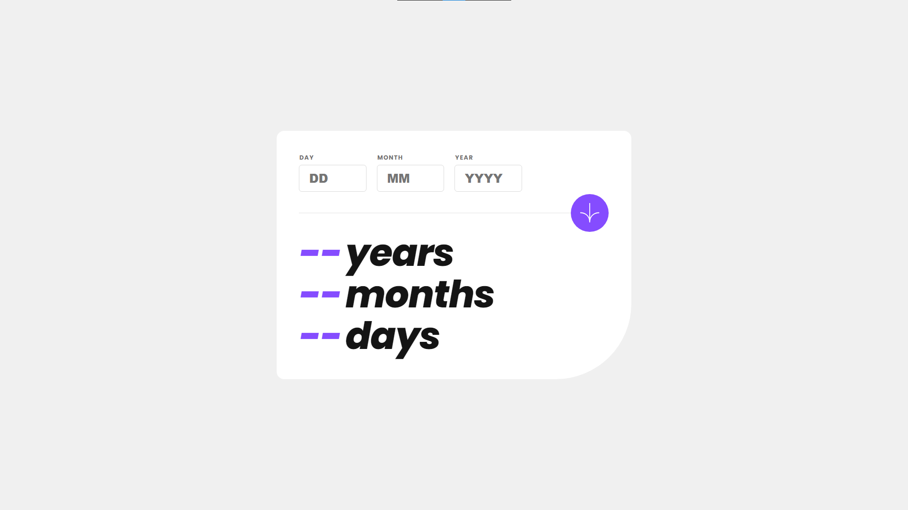

# Frontend Mentor - Age calculator app solution

This is a solution to the [Age calculator app challenge on Frontend Mentor](https://www.frontendmentor.io/challenges/age-calculator-app-dF9DFFpj-Q). Frontend Mentor challenges help you improve your coding skills by building realistic projects. 

## Table of contents

- [Overview](#overview)
  - [The challenge](#the-challenge)
  - [Screenshot](#screenshot)
  - [Links](#links)
- [My process](#my-process)
  - [Built with](#built-with)
  - [What I learned](#what-i-learned)
- [Author](#author)

## Overview

### The challenge

Users should be able to:

- View an age in years, months, and days after submitting a valid date through the form
- Receive validation errors if:
  - Any field is empty when the form is submitted
  - The day number is not between 1-31
  - The month number is not between 1-12
  - The year is in the future
  - The date is invalid e.g. 31/04/1991 (there are 30 days in April)
- View the optimal layout for the interface depending on their device's screen size
- See hover and focus states for all interactive elements on the page
- **Bonus**: See the age numbers animate to their final number when the form is submitted

### Screenshot

### Links

- Solution URL: [Solution](https://www.frontendmentor.io/solutions/age-calculator-app-html-css-js-and-momentjs-ExY4RLNXg1)
- Live Site URL: [Preview](https://ninhos0.github.io/Age-calculator-app-solution/)
- Code URL: [Github](https://github.com/NINHOS0/Age-calculator-app-solution)

## My process

### Built with

- HTML5
- CSS
- Flexbox
- CSS Grid
- [Moment.js](https://momentjs.com/) - JS library

### What I learned

- During development I tried to apply the fundamentals of clean code.
- In this project i discovered the moment.js javascript library, to help with the use of dates.

## Author

- Frontend Mentor - [@NINHOS0](https://www.frontendmentor.io/profile/NINHOS0)
- Github - [@NINHOS0](https://github.com/NINHOS0)
